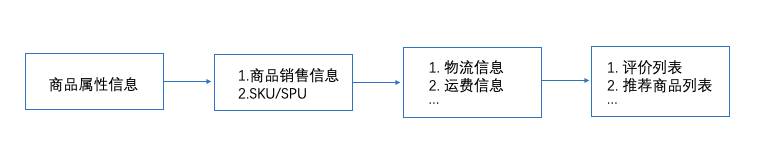
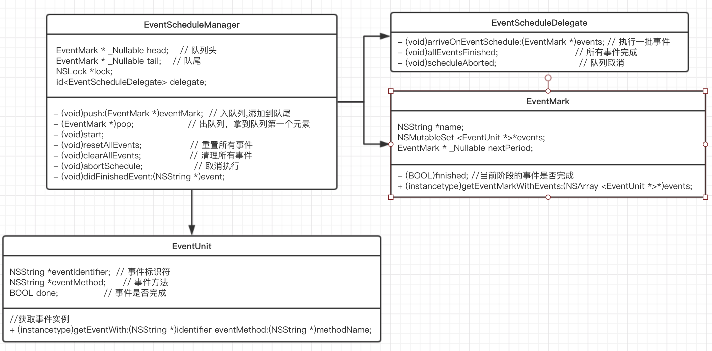

首先描述一下背景：目前在做电商 APP 的页面改版，主要工作集中在商品详情页上。商品详情页的数据比较繁多，涉及到近 20 个网络接口。 这些接口中有的还存在依赖关系，而且重要程度也不尽相同。为了兼顾这些接口的并发性能和依赖关系，模仿 `dispatch_group` 的接口设计，写了一个批量事件管理队列的工具 `EventScheduleManager` 。

### 模型抽象

商品详情页需要的数据有：

1. 商品属性信息，包含商品ID、商品名、图册等等
2. 商品销售信息，包含价格、销售状态、优惠信息
3. SKU/SPU 信息
4. 商品运费信息
5. 商品物流信息，最早可达时间信息
6. 评价列表信息
7. 推荐商品列表

这里暂时列出这些

根据以上列表不难看出，商品属性、销售信息和SKU/SPU信息最为重要，运费、物流信息次之，评价、推荐信息优先级最低。

在这里，把所有事件分成多个批次，每个批次包含多个相互独立的事件，依次执行每个批次，
当优先级高的批次执行完之后，再执行优先级低的批次，如此形成一个队列。
因为执行队列保持顺序执行，依赖关系也被很好的隔离开来。



### 代码实现

 由于多个事件分为多个批次执行，而且批次之间需要保持顺序，所以这里使用单向链表构建事件队列。
 


首先创建一个 队列模型类 `EventScheduleManager`，然后在 `EventScheduleManager` 的子类内部创建队列。  

`EventUnit`  事件类，包含唯一标志符、执行方法、执行状态。  
`EventMark`  队列节点类，包含事件集合、批次名称  
`EventScheduleManager`  队列管理类  
`EventScheduleDelegate` 队列回调事件

创建子类继承`EventScheduleManager`，在子类内部创建队列：

```Objective-C
- (void)createSchedule {
    // 清空
    [self clearAllEvents];
    
    //第一阶段
    EventUnit *unit_1 = [EventUnit getEventWith:ProductDetailGetBasicInfo eventMethod:@"ProductBasicInfo"];

    EventMark *mark_1 = [EventMark getEventMarkWithEvents:@[unit_1]];
    mark_1.name = @"第一阶段";
    
    [self push:mark_1];
    
    
    //第二阶段
    EventUnit *unit_2 = [EventUnit getEventWith:ProductDetailGetSaleInfo eventMethod:@"ProductSaleInfo"];
    EventUnit *unit_4 = [EventUnit getEventWith:ProductDetailItemUniqueInfo eventMethod:@"ItemUniqueInfo"];

    EventMark *mark_2 = [EventMark getEventMarkWithEvents:@[unit_2,unit_4]];
    mark_2.name = @"第二阶段";
    
    [self push:mark_2];
    
    // 第一个 milestone 完成
    EventUnit *first = [EventUnit getEventWith:ProductDetailFirstStage eventMethod:@"fistStageFinished"];
    
    EventMark *firstMileStone = [EventMark getEventMarkWithEvents:@[first]];
    firstMileStone.name = @"firstMileStone";
    
    [self push:firstMileStone];
    
    //第三阶段
    EventUnit *unit_8 = [EventUnit getEventWith:ProductDetailLogistics eventMethod:@"LogisticsInfo"];
    EventUnit *unit_9 = [EventUnit getEventWith:ProductDetailFreightInfo eventMethod:@"FreightInfo"];

    EventMark *mark_3 = [EventMark getEventMarkWithEvents:@[unit_8,unit_9]];
    mark_3.name = @"第三阶段";
    
    [self push:mark_3];
    
    // 第二个 milestone 完成
    EventUnit *second = [EventUnit getEventWith:ProductDetailSecondStage eventMethod:@"secondStageFinished"];
    
    EventMark *secondMileStone = [EventMark getEventMarkWithEvents:@[second]];
    secondMileStone.name = @"secondMileStone";
    
    [self push:secondMileStone];
    
    //第四阶段
    EventUnit *unit_10 = [EventUnit getEventWith:ProductDetailRecommend eventMethod:@"RecommendInfo"];
    EventUnit *unit_13 = [EventUnit getEventWith:ProductDetailComments eventMethod:@"CommentsInfo"];

    EventMark *mark_4 = [EventMark getEventMarkWithEvents:@[unit_10,unit_13]];
    mark_4.name = @"第四阶段";
    
    [self push:mark_4];
}
```
父类执行方法

```Objective-C
// 开始执行
- (void)start {
    
    EventMark *events = [self pop];
    
    if (events) {
        
        [self excuteEvents:events];
        
    } else {
        // 所有事件执行完毕
        _currentEvents = nil;
        if ([self.delegate respondsToSelector:@selector(allEventsFinished)]) {
            [self.delegate allEventsFinished];
        }
    }
}

```

```Objective-C
// 执行事件
- (void)excuteEvents:(EventMark *)events{
    [self.lock lock];
    self.currentEvents = events;
    if ([self.delegate respondsToSelector:@selector(arriveOnEventSchedule:)]) {
        [self.delegate arriveOnEventSchedule:events];
    }
    [self.lock unlock];
}
```

在管理事件队列处，生成队列实例，创建队列，开启队列执行。

```
    self.scheduleManager = [[ProductDetailSchedule alloc] init];  
    self.scheduleManager.delegate = self;  
    // 创建队列
    [self.scheduleManager createSchedule];  
    [self.scheduleManager start];
    
```

事件方法执行, 这里根据字符串转方法，在子线程异步执行

```Objective-C
- (void)arriveOnEventSchedule:(EventMark *)events{
    
    [events.events enumerateObjectsUsingBlock:^(EventUnit * _Nonnull obj, BOOL * _Nonnull stop) {
        
        dispatch_async(dispatch_get_global_queue(DISPATCH_QUEUE_PRIORITY_DEFAULT, 0), ^{
                        
            SEL selector = NSSelectorFromString(obj.eventMethod);
            if ([self respondsToSelector:selector]) {
                
                IMP imp = [self methodForSelector:selector];
                void (*func)(id, SEL) = (void *)imp;
                func(self, selector);
            }
        });
    }];
}
```
